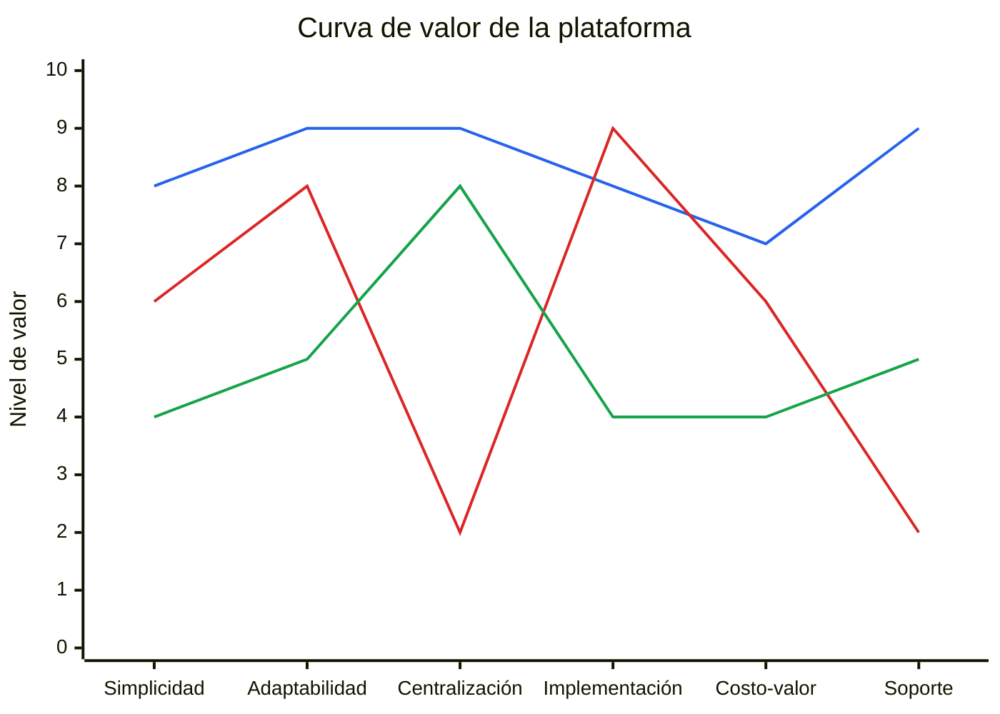

# Curva de Valor

La siguiente curva de valor representa una hipótesis estratégica inicial sobre cómo se posiciona la plataforma frente a dos alternativas habituales: procesos manuales con herramientas dispersas y software administrativo generalista. La escala va de `0` a `10`, donde `10` representa un desempeño más alto en cada factor.

## Factores evaluados

- **Simplicidad**: facilidad de uso y baja fricción operativa.
- **Adaptabilidad**: capacidad de ajustar programas, formularios, documentos y cobros según el cliente.
- **Centralización**: grado en que el flujo completo vive en una sola herramienta.
- **Implementación**: rapidez para poner la solución en marcha.
- **Costo-valor**: relación entre lo que el cliente paga y el valor operativo que recibe.
- **Soporte**: cercanía, acompañamiento y capacidad de respuesta.

## Series

- **Azul**: Nuestra plataforma.
- **Rojo**: Procesos manuales y herramientas dispersas.
- **Verde**: Software administrativo generalista.

## Supuestos de evaluación

- La curva es **cualitativa** y compara percepciones de valor, no precios exactos de mercado.
- `Costo-valor` no significa “la opción más barata”, sino la alternativa con mejor equilibrio entre coste, velocidad de adopción y valor operativo.
- En `Implementación`, una puntuación alta significa menor esfuerzo y menor tiempo para empezar a operar.
- Los procesos manuales pueden parecer económicos al inicio, pero pierden valor por dispersión, retrabajo y menor trazabilidad.
- El software generalista suele centralizar parte de la operación, pero normalmente exige mayor adaptación, más esfuerzo de implementación y un coste menos accesible para clientes pequeños o medianos.
- La evaluación está basada en el contexto real del producto, el cliente actual y el tipo de cliente objetivo definido en el canvas.

## Fundamentación resumida

| Factor | Nuestra plataforma | Manual / disperso | Software generalista |
|---|---|---|---|
| **Simplicidad** | Alta por enfoque específico y flujo claro. | Media: familiar, pero fragmentado. | Baja-media por mayor complejidad funcional. |
| **Adaptabilidad** | Muy alta por configuración de programas, formularios y cobros. | Alta por improvisación manual, pero poco escalable. | Media por límites del producto estándar. |
| **Centralización** | Muy alta al integrar formulario, documentos y pagos. | Baja por uso de herramientas separadas. | Alta, aunque no siempre alineada al proceso exacto. |
| **Implementación** | Alta por foco y menor peso que un sistema amplio. | Muy alta porque puede arrancar de inmediato. | Media-baja por esfuerzo de adopción y configuración. |
| **Costo-valor** | Alta por equilibrio entre coste y utilidad operativa. | Media: bajo coste aparente, pero con ineficiencias ocultas. | Media-baja por mayor coste y menor ajuste al caso específico. |
| **Soporte** | Muy alto por cercanía y capacidad de ajuste. | Bajo porque no existe un soporte estructurado. | Medio por soporte formal, pero menos cercano y menos flexible. |

## Lectura estratégica

- La propuesta se diferencia por su **simplicidad operativa**, **adaptabilidad** y **centralización** de formularios, documentos y pagos.
- Frente a procesos manuales, reduce dispersión, retrabajo y falta de trazabilidad.
- Frente a software generalista, ofrece una solución más enfocada, rápida de implementar y alineada con operaciones concretas.
- La oportunidad de posicionamiento está en competir menos por amplitud funcional y más por **claridad, rapidez y adecuación al proceso real del cliente**.
