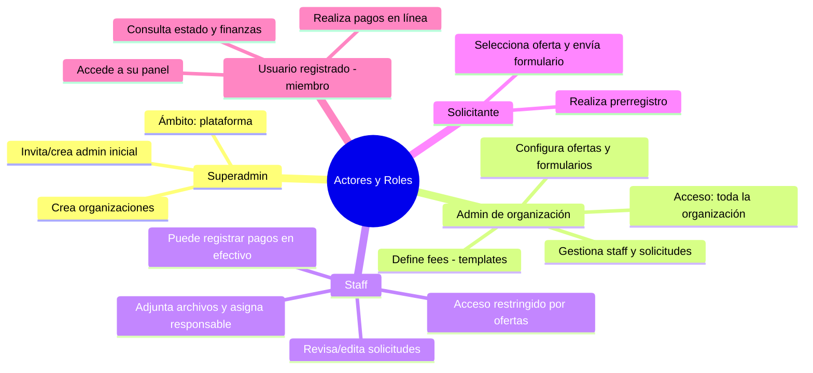
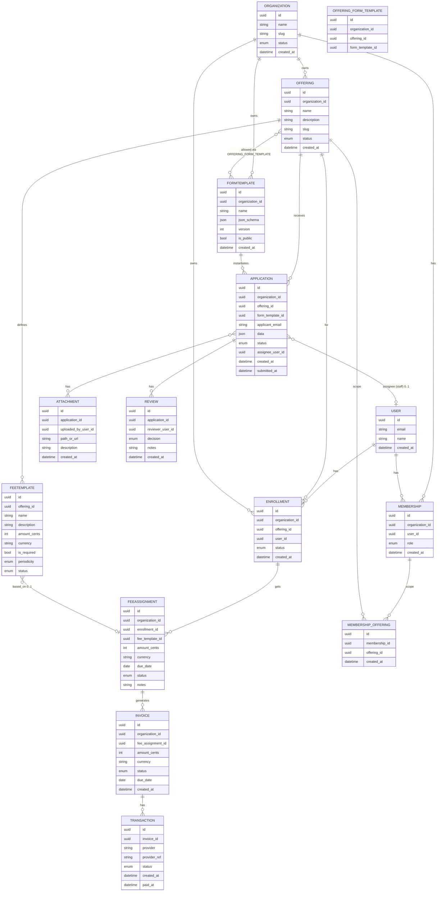
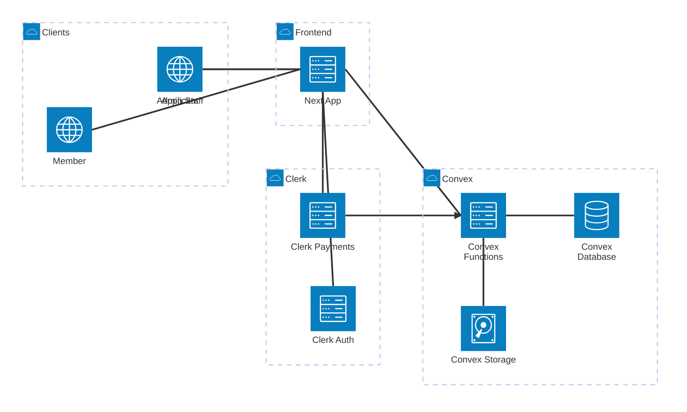

Implementación de **sistema multitenant de gestión de inscripciones y pagos** para múltiples compañías (“organizaciones”). El MVP cubre: alta de organizaciones, administración de “ofertas” (antes “etiquetas”), prerregistro de usuarios, revisión y admisión, gestión de cuentas registradas y asignación/registro de **fees** (cargos) con pagos en línea o en efectivo.

---
## Alcance y contexto
- **Multitenancy**: cada organización opera aislada del resto; todas las entidades de negocio llevan `organization_id`.
- **Portal público por organización**: `https://cpca/{org_slug}/` expone ingreso y prerregistro.
- **Panel interno**: `https://cpca/{org_slug}/admin` para el personal autorizado (admin y staff).

---
## Actores y roles
- **Superadmin (plataforma)**: crea organizaciones y su usuario administrador inicial.
- **Administrador de organización (admin)**: configura ofertas, fees, formularios; gestiona usuarios, staff y solicitudes; ve toda la información de su organización.
- **Staff**: usuario interno con acceso **restringido por oferta(s)** asignada(s); gestiona únicamente solicitudes y datos vinculados a esas ofertas.
- **Solicitante**: persona externa que realiza un **prerregistro**.
- **Usuario registrado (miembro)**: solicitante aceptado que ya posee cuenta y acceso a su panel de estado y finanzas.

---
## Modelo de dominio (conceptos principales)
### Organización
- **Campos**: `name`, `slug` (p. ej., “A”), `status {active,inactive}`.
- Creada por **Superadmin** junto con el **admin** inicial (“adminA”).
### Oferta (también “objeto de cobro”)
Unidad de inscripción y cobro, e. g., _fútbol_, _baloncesto_, _curso X_.
- **Campos**: `name`, `description`, `status {active,inactive}`.
- **Asociación a fees**: conjunto de **fees predefinidos** (con indicador de obligatoriedad) que podrán asignarse a los usuarios registrados de esa oferta.

> Nota de nomenclatura: “**Oferta**” es más general que “objeto de cobro” y refleja que puede implicar inscripción y pagos. Internamente puede usarse el término `offering`.
### Fee
- **Dos niveles**:
    1. **FeeTemplate** (definición a nivel de oferta): `name`, `description`, `amount`, `currency`, `is_required`, `periodicity {one_time,recurring}`, `status`.
    2. **FeeAssignment** (asignación a un usuario registrado): referencia al template o **fee ad-hoc** (monto y descripción personalizados), `due_date`, `status {pending,paid,void,failed}`, `notes`.
### Formulario de prerregistro (FormTemplate)
- **Campos**: `name`, `json_schema` (definición de campos), `version`, `is_public`.
- **Relación**: una o varias **ofertas** pueden vincularse a un mismo formulario; una misma oferta puede aceptar múltiples formularios si procede.
### Solicitud / Aplicación (Application)
Instancia de prerregistro enviada por un solicitante para una **oferta** concreta.
- **Campos**: `applicant_email`, `data` (respuestas), `status {draft,submitted,under_review,changes_requested,approved,rejected}`, `assignee_user_id` (responsable), `attachments[]` (archivos añadidos por staff), `timestamps`.
- **Reglas**:
    - El **staff** puede **editar campos** y **adjuntar archivos** al evaluar.
    - El **rechazo** exige **motivo** (campo de texto obligatorio).
### Usuario registrado y pertenencias
- Al **aprobar** una solicitud se crea la **cuenta de usuario** (si no existe) y su **membresía** en la organización. En el caso de ya existir se añade la oferta adicional.
- Note que el usuario es creado con una oferta asociada.
### Pagos
- **Pasarela** para pagos en línea (p. ej., integración con una gateway; el texto contempla _Clerk Payments_ como alternativa).
- **Pagos en efectivo**: el staff puede **marcar manualmente** un fee como pagado; siempre se registra **fecha de pago** y **responsable** para auditoría.
- **Historial**: todos los pagos generan una **transacción** con `timestamp` para conciliación y filtros posteriores.

---
## Flujos operativos

### Alta de organización
1. **Superadmin** crea `Organization (A)` y **adminA**.
2. adminA accede a `cpca/A/admin`.
### Configuración inicial del admin
1. Crea **Ofertas** (e. g., _fútbol_, _baloncesto_) con `name`, `description`, `status`.
2. Define **FeeTemplates** por oferta (monto, obligatoriedad, periodicidad).
3. Crea **FormTemplates** (campos personalizados) y los **asocia** a una o varias ofertas.
4. Crea **staff**: `name`, `email`, `phone` y **ofertas asignadas** (una o varias).
    - El **ámbito de visibilidad** del staff queda limitado a sus ofertas.
### Prerregistro público
1. El solicitante visita `https://cpca/A/`.  
    La vista ofrece **ingreso** y **opción de prerregistro** (la autenticación distingue roles y redirige).
2. El solicitante elige una **oferta**; el sistema muestra el **formulario** asociado.
3. Envía la **solicitud** → pasa a `submitted` y queda **visible en el panel** de “Solicitudes”.
### Revisión por staff/admin
1. **Listado de solicitudes**:
    - **Staff** ve **solo** las de sus **ofertas asignadas**.
    - **Admin** ve **todas** las de la organización.
2. En cada solicitud: **editar campos**, **adjuntar archivos**, **asignar responsable** (opcional y solo con objeto de trazabilidad y organización).
3. **Decisión**:
    - **Aprobar** → crear cuenta (si aplica), membresía e inscripción; mover a “**Registrados**”.
    - **Rechazar** → motivo obligatorio; notificación al solicitante si está habilitada.
    - **Solicitar cambios** → vuelve a `changes_requested`.
### Gestión de usuarios registrados y finanzas
1. En el perfil del **usuario registrado**:
    - Ver y **editar datos** (según permisos).
    - **Asignar fees**: desde los **templates** de la oferta o **crear fee ad-hoc**.
2. **Balances** visibles para staff/admin y para el propio usuario:
    - **Pendiente (pending)**, **Pagado (paid)** y **Balance total**.
3. **Pagos**:
    - **En línea** (pasarela integrada).
    - **En efectivo**: staff marca como **pagado**, se registra **fecha** y **responsable**.
4. **Historial y filtros**:
    - Cada pago conserva su **fecha de pago** y estado para búsquedas, reportes y conciliación.

---
## Reglas de negocio clave
- Toda consulta y mutación se restringe por `organization_id`.
- **Staff** solo accede a datos **vinculados** a sus ofertas.
- **Rechazos** deben incluir **justificación** textual.
- **Pagos en efectivo** no sustituyen registros de la pasarela: generan **asientos** equivalentes con metadatos de auditoría.
- Los **FeeTemplates** marcan obligatoriedad; la **asignación efectiva** a cada usuario puede planificarse por fechas y periodicidad.
- **Estados** son inmutables en histórico (no se borran; se agregan **eventos** de corrección o reverso).

---
## Vistas del sistema (MVP)
### Panel del admin
- Resumen general (solicitudes por estado, montos pendientes/pagados).
- CRUD de **Ofertas**, **FeeTemplates**, **FormTemplates**.
- Gestión de **staff** y **permisos por oferta**.
- Listados globales: **Solicitudes**, **Registrados**, **Pagos**.
### Panel del staff
- **Solicitudes** de sus ofertas: filtros por estado, responsable, fecha.
- Detalle de solicitud: edición de campos, adjuntos, asignación, decisión.
- **Registrados** de sus ofertas: ficha con datos y **finanzas** (asignación de fees, registro de pagos en efectivo).
### Panel del usuario registrado
- Estado de su(s) oferta(s) y **finanzas**: fees **pendientes** y **pagados**.
- Flujo de **pago en línea** y comprobantes.
### Portal público
- Ingreso (autenticación) y **prerregistro** por **oferta**.

---
## Estados y transiciones (resumen)
- **Solicitud**: `draft → submitted → under_review → {approved | rejected | changes_requested} → (si changes) submitted`.
- **Asignación** de responsable: editable mientras `under_review`.
- **FeeAssignment**: `pending → paid | void | failed` (cada transición registra fecha y actor).
- **Usuario**: al **approved** se crea la cuenta/membresía; aparece en “Registrados”.

---
## Seguridad y cumplimiento
- **Control de acceso por rol y por oferta** (scoping fino).
- **Auditoría**: toda acción crítica (aprobación, rechazo, asignación, registro de pago en efectivo) registra usuario, marca de tiempo y justificación cuando aplique.
- **Trazabilidad financiera**: relación FeeAssignment ↔ Transacciones/Pagos (incluida la marca de “pago en efectivo”).

---
## Consideraciones de diseño (para guiar la implementación)
- Mantener **separación** entre _definición_ de fees (templates) y _asignaciones_ a usuarios.
- Formularios **versionados**; cada solicitud guarda `template_version`.
- URLs con `org_slug` para ruteo y aislamiento.
- Los **filtros por fecha de pago** y estado deben estar **indexados** para reportes.

---
## Glosario 
- **Oferta (Offering)**: unidad de inscripción y cobro (sustituye a “etiqueta”).
- **FeeTemplate**: definición de cargo asociada a una oferta.
- **FeeAssignment**: cargo asignado a un usuario (puede ser ad-hoc).
- **Solicitud/Aplicación**: prerregistro que inicia el proceso.
- **Registrado/Miembro**: usuario aceptado con acceso a su panel.
